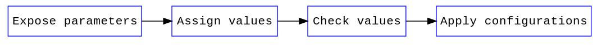
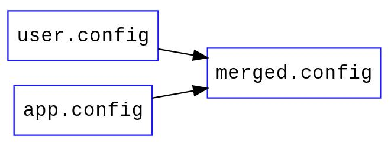
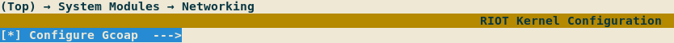

# Configuring RIOT using Kconfig              {#configuring-riot-using-kconfig}

[TOC]

The objective of using Kconfig for RIOT is to configure software modules at
compilation. This means having a standard way of:
- Exposing configurable parameters
- Assigning application and user-specific configurations
- Verifying these parameters
    - Check possible values
    - Check valid configuration considering inter-dependencies
- Applying the selected configuration

# Overview                                                  {#kconfig-overview}



## Exposure
Modules in RIOT expose their configurable parameters via
[Kconfig](https://www.kernel.org/doc/Documentation/kbuild/kconfig-language.txt)
files.
In these files documentation, restrictions, default values and dependencies can
be expressed.

Kconfig files are structured through the file system mirroring the current
module distribution. In time, all modules would have Kconfig files to make
themselves configurable through this system.

## Assignment
The user can assign values to the exposed parameters, either by manually writing
'.config' files or using an interface such as Menuconfig. Parameters with no
assigned values will take the default ones. For a detailed distinction between
Kconfig and '.config' files see
[Appendix B](#Appendix-B-Difference-between-‘Kconfig’-and-‘config’-files).

## Verification and application
Using '.config' and Kconfig files the `genconfig` script takes care of doing the
necessary checks on the values according to the parameter definition. After
that, the `autoconf.h` header file is generated containing all the
configurations in the form of (`CONFIG_` prefixed) macros.

---
# User's guide to configure with Kconfig                 {#kconfig-users-guide}

### Configure using menuconfig
In order to use the graphical interface menuconfig to configure the
application, run `make menuconfig` in the application folder. All available
configurations (based on the used modules) will be presented. In order to
activate the configuration of a module via Kconfig the correspondent option
should be selected. That will enable the configuration of all inner options,
if available.

Once the desired configuration is achieved save the configuration to the
default proposed path and exit. Now the configuration has been saved and
will be applied when the code is compiled (`make all`).

If the current configuration will be used in the future it can be saved in the
application folder with the name of `user.config`, and it will be persistent
after cleaning the application directory via `make clean`.

## Configure using '.config' files
The second way to configure the application is by directly writing '.config'
files. Two files will be sources of configuration during the generation of the
final header file: `app.config` and `user.config`,
**in that particular order**. As the order matters, configurations from
`app.config` can be overridden by `user.config`.

Let's say that the `SOCK_UTIL_SCHEME_MAXLEN` symbol in `sock_util` module needs
to be configured. The `user.config` file could look like:

```Makefile
# activate configuration of sock_util using Kconfig
CONFIG_KCONFIG_MODULE_SOCK_UTIL=y
# change scheme part length
CONFIG_SOCK_UTIL_SCHEME_MAXLEN=24
```

In this case, there is no need for using menuconfig. It's enough just to call
`make all` in the application folder, as this configuration will be read and
applied. Note that if any dependency issue occurs, warnings will be generated
(e.g. not enabling the configuration of a module via Kconfig).

## A note on the usage of CFLAGS
When a certain module is being configured via Kconfig the configuration macro
will not longer be overridable by means of CFLAGS (e.g. set on the
compilation command or on a Makefile). Consider this if you are getting a
'redefined warning'.

---
# Integration into the build system    {#kconfig-integration-into-build-system}


## 0. Module dependency resolution
Currently, the resolution of module dependencies is being performed by the build
system where all the used modules end up listed in the `USEMODULE` make
variable. In the next phases of integration we plan to resolve dependencies
using Kconfig.


### Input
- Makefiles.

### Output
- `USEMODULE` variable.

## 1. Module listing
The list of modules needed for the particular build (stored in the `USEMODULE`
variable) is dumped into the `$(GENERATED_DIR)/Kconfig.dep` file, where each
module is translated into a Kconfig symbols `config MODULE_<MOD_NAME>` as
documented in [Appendix A](#kconfig-appendix-a).

### Input
- Makefiles contaning required modules and dependencies

### Output
- `$(GENERATED_DIR)/Kconfig.dep` file

## 2. Merging all configuration sources
In this step configuration values are taken from multiple sources and merged
into a single `merged.config` configuration file. This file is temporary and is
removed on clean, if the user needs to save a particular configuration
set, a backup has to be saved (this can be done using the menuconfig interface)
so it can be loaded later in this step.

To accomplish merging of multiple input files, the `mergeconfig` script is used.
Note that **the order matters**: existing configuration values are merged in the
order expressed in the input section, where **the last value assigned to a
parameter has the priority**. Any configuration file that is not present will be
ignored. If no configuration files are available all default values will be
applied.

`merged.config` is the only configuration input for the `autoconf.h` generation in
step 4.



### Input
- Optional:
    - `$(APPDIR)/app.config`: Application specific default configurations.
    - `$(APPDIR)/user.config`: Configurations saved by user.

### Output
- `$(GENERATED_DIR)/merged.config` file.

## 3. Menuconfig execution (optional)
Menuconfig is a standard interface for software configuration. It is used for
the configuration of the Linux kernel. This section explains the process
that occurs when RIOT is being configured using the menuconfig interface.

The main `Kconfig` file is used in this step to show the configurable
parameters of the system. Kconfig will filter not available parameters (i.e.
parameters exposed by modules that are not being used) based on the file
`$(GENERATED_DIR)/Kconfig.dep` generated in step 1.

By default, during the transition phase, module configuration via Kconfig will
not be enabled, and the user should explicitly enable this (see
[Making configuration via Kconfig optional](#kconfig-configuration-optional)).

The `merged.config` file is a merged configuration file of the files listed
in the Input section (in that specific order). This means that any configuration
that the application defines in the `app.config` or a backup configuration
from the user in `user.config` are taken into account on the first run (see 
[Appendix C](#kconfig-appendix-c)).

In this step the user chooses configuration values (or selects the minimal
configuration) and saves it to the `merged.config` file. The default location
of the `merged.config` file is the one used later in the process, but the user can
choose to save a backup configuration file for later at a different location
(e.g. a `user.config` file in the application folder).

### Input
- `/Kconfig` file.
- Optional:
    - `$(APPDIR)/app.config`: Application specific default configurations.
    - `$(APPDIR)/user.config`: Configurations saved by user.
    - `$(GENERATED_DIR)/merged.config`: Optionally configuration from previous run

### Output
- Updated `$(GENERATED_DIR)/merged.config` file.
- `$(GENERATED_DIR)/merged.config.old` backup file.
- Optional:
    - User saved configuration backup.

## 4. Generation of the autoconf.h header
With the addition of Kconfig a dependency has been added to the build
process: the `$(GENERATED_DIR)/autoconf.h` header file. This header file is
the main output from the Kconfig configuration system. It holds all the macros
that should be used to configure modules in
RIOT: `CONFIG_<module>_<parameter>`.

In order to generate the `autoconf.h` file the `genconfig` script is being
used. Inputs for this script are the main `Kconfig` file and a `.config`
configuration file, which holds the selected values for the exposed parameters.

The configuration file used is `$(GENERATED_DIR)/merged.config`.

### Input:
- Existing configuration values merged in `$(GENERATED_DIR)/.config` file.
- Main `Kconfig` file exposing configuration of modules.

### Output:
- `$(GENERATED_DIR)/autoconf.h` configuration header file.


## Summary of files
_These files are defined in `kconfig.inc.mk`_.

| File              | Description |
| ----------------- | ----------- |
| Kconfig           | Defines configuration options of modules. |
| Kconfig.dep       | Holds a list of the modules that are being compiled. |
| app.config        | Holds default application configuration values. |
| user.config       | Holds configuration values applied by the user. |
| merged.config     | Holds configuration from multiple sources. Used to generate header. |
| autoconf.h        | Header file containing the macros that applied the selected configuration. |


---
# Transition phase                                  {#kconfig-transition-phase}
## Making configuration via Kconfig optional  {#kconfig-configuration-optional}
During transition to the usage of Kconfig as the standard way to configure
modules in RIOT, the default behavior will be the traditional one: expose
configuration options in header files and use CFLAGS, Makefile variables and
others as inputs. To allow optional configuration via Kconfig, a convention
will be used when writing Kconfig files.

Modules should be contained in their own `menuconfig` entries, this way the user
can choose to enable the configuration via Kconfig for this specific module.
These entries should depend on the module being used (see
[Appendix A](#kconfig-appendix-a) to see how to check if a module is being
used).


The module configuration then can be enabled either via the menuconfig
interface:



or by means of a '.config' file:

```Make
CONFIG_KCONFIG_MODULE_GCOAP=y
```

---
# Appendixes                                              {#kconfig-appendixes}
## Appendix A: Check if a module is being used            {#kconfig-appendix-a}
In order to show only the relevant configuration parameters to the user with
respect to a given application and board selection, Kconfig needs knowledge
about all modules to be used for a compilation. Currently dependency handling
among modules is performed by the build system. The interface defined to
declared the used modules is the `$(GENERATED_DIR)/Kconfig.dep` file.

This file is a Kconfig file that will define symbols of the form:
```Kconfig
config MODULE_SOCK_UTIL
    bool
    default y
```
There will be a symbol for every used module (i.e. every module in
`USEMODULE` make variable). All modules names in the symbols will be uppercase
and separated by `_`. Based on these symbols configurability is decided.

The following is an example of how to use these symbols in Kconfig files to
enable/disable a configuration menu:

```Kconfig
menuconfig KCONFIG_MODULE_SOCK_UTIL
    bool "Configure Sock Utilities"
    depends on MODULE_SOCK_UTIL
    help
        "Enable this to configure Sock Utilities using Kconfig."
```

Then, every configuration option for the previous module would be modeled like:

```Kconfig
if KCONFIG_MODULE_SOCK_UTIL

config SOCK_UTIL_SCHEME_MAXLEN
    int "Maximum length of the scheme part for sock_urlsplit"
    default 16

endif # KCONFIG_MODULE_SOCK_UTIL
```

## Appendix B: Difference between 'Kconfig' and '.config' files {#kconfig-appendix-b}
Kconfig files describe a configuration database, which is a collection of
configuration options organized in a tree structure. Configuration options have
their own dependencies, which are used to determine its visibility.

Kconfig files are written in
[Kconfig language](https://www.kernel.org/doc/Documentation/kbuild/kconfig-language.txt)
defined in the Linux kernel. Configuration options have attributes such as
types, prompts and default values:

```Kconfig
menu "Buffer Sizes"

config GCOAP_PDU_BUF_SIZE
    int "Request or response buffer size"
    default 128

endmenu
```

On the other hand configuration files contain assignment of values to
configuration options and use Make syntax:

```makefile
# enable Kconfig configuration for gcoap
CONFIG_KCONFIG_MODULE_GCOAP=y
# set the value
CONFIG_GCOAP_PDU_BUF_SIZE=12345
```
They can also be used to save a set of configuration values as backup.

In other words: Kconfig files describe configuration options and '.config' files
assign their values.

## Appendix C: Pitfall when using different configuration interfaces {#kconfig-appendix-c}
In the current configuration flow the user can choose to configure RIOT using
the menuconfig graphical interface or writing '.config' files by hand.

As explained in step 2 of the configuration process, configuration from multiple
sources are loaded to create a single `merged.config` file, and the order of
merging matters: last file has priority.

While editing values directly via '.config' files `merged.config` will be
re-built. Once the user decides to edit `merged.config` directly using
menuconfig, the file will not be re-built anymore, and any changes by manually
editing the source files will have no effect. To go back to manual edition
a `make clean` has to be issued in the application directory.

